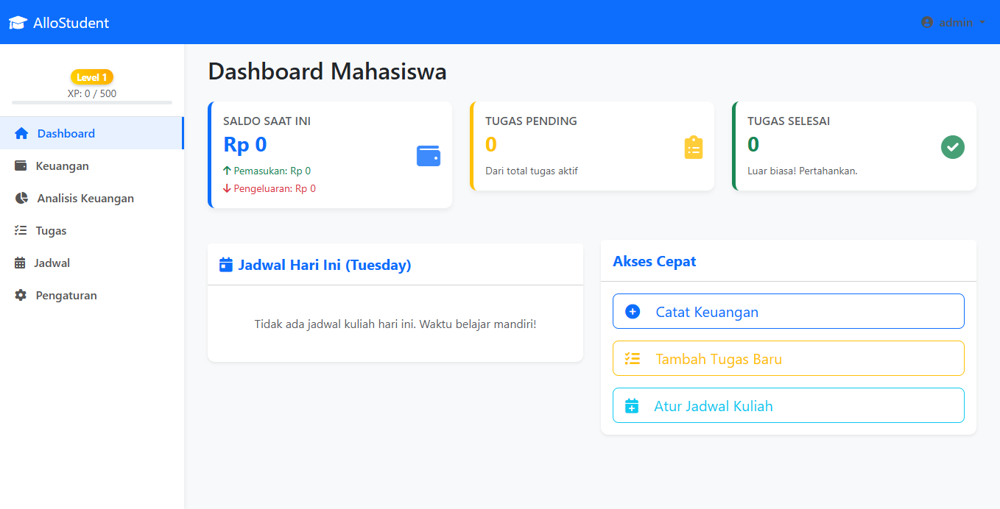

<p align="center"></p>

<h1 align="center">AlloStudent</h1>

<p align="center">
  <strong>Solusi All-in-One untuk Manajemen Kehidupan Kampus</strong>
</p>

<p align="center">
  AlloStudent adalah aplikasi web berbasis Laravel yang dirancang khusus untuk membantu mahasiswa mengelola produktivitas sehari-hari. Mulai dari pencatatan keuangan, pelacakan tugas kuliah, hingga pengaturan jadwal kegiatan, semuanya dalam satu dasbor yang intuitif.
</p>

---

## 🚀 Fitur Utama

- **💰 Manajemen Keuangan:** Pantau pemasukan dan pengeluaran harian agar kondisi dompet tetap terjaga selama masa kuliah.
- **📝 Pelacakan Tugas:** Kelola daftar tugas (to-do list) dan pastikan tidak ada tenggat waktu (deadline) yang terlewat.
- **📅 Pengaturan Jadwal:** Atur jadwal kuliah dan aktivitas mandiri dengan tampilan yang rapi dan terorganisir.
- **✨ Antarmuka Ramah Pengguna:** Dasbor bersih dan responsif, memudahkan navigasi bagi setiap mahasiswa.

---

## 🛠 Teknologi yang Digunakan

* **Backend:** [Laravel](https://laravel.com/) (Framework PHP modern)
* **Database:** MySQL
* **Frontend:** HTML5, CSS3, & JavaScript (Didukung oleh sistem templating Blade)

---

## 📦 Cara Menjalankan Proyek

Pastikan Anda sudah menginstal **PHP**, **Composer**, dan **Laragon/XAMPP** di komputer Anda.

1.  **Clone repositori ini:**
    ```bash
    git clone [https://github.com/SyafiiHsb/AlloStudent.git](https://github.com/SyafiiHsb/AlloStudent.git)
    ```

2.  **Masuk ke direktori proyek:**
    ```bash
    cd AlloStudent
    ```

3.  **Instal *dependencies*:**
    ```bash
    composer install
    ```

4.  **Konfigurasi file `.env`:**
    - Salin file `.env.example` menjadi `.env`: `cp .env.example .env`
    - Sesuaikan konfigurasi database Anda di dalam file `.env`.

5.  **Generate key aplikasi:**
    ```bash
    php artisan key:generate
    ```

6.  **Jalankan migrasi database:**
    ```bash
    php artisan migrate
    ```

7.  **Jalankan server lokal:**
    ```bash
    php artisan serve
    ```
    Aplikasi Anda sekarang dapat diakses di `http://127.0.0.1:8000`.

---

## 📸 Preview Dasbor


---

## 🤝 Kontribusi
Proyek ini bersifat *open-source*. Jika Anda memiliki saran, penambahan fitur, atau ingin melaporkan *bug*, silakan buka [Issues](https://github.com/SyafiiHsb/AlloStudent/issues) atau ajukan *Pull Request*.

## 📝 Lisensi
Proyek ini dilisensikan di bawah [MIT License](https://opensource.org/licenses/MIT).

---
<p align="center">Dibuat dengan ❤️ untuk mahasiswa produktif.</p>
